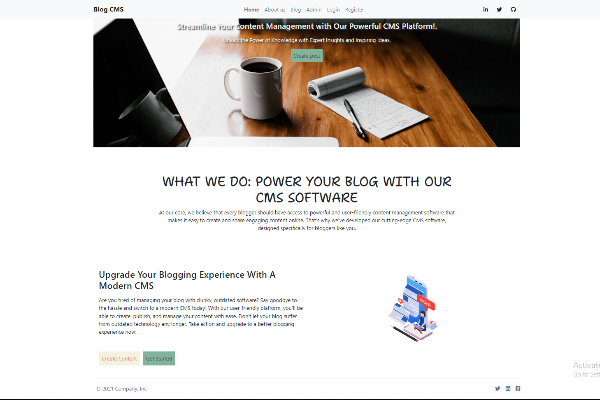
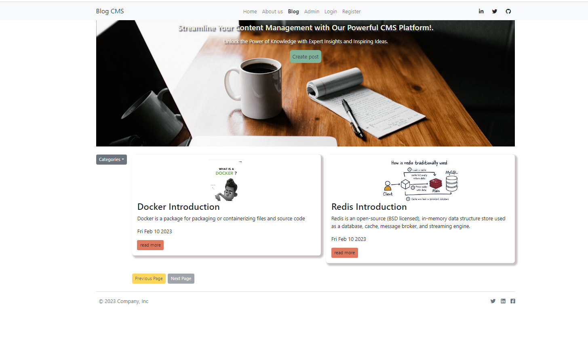

## Blog CMS system with MERN stack

Blog CMS system is created with the mindset of enabling individuals to create articles, blog, written content etc. Readers are attracted to content or articles that have images or videos. As a result of this, i give the content creators the option to apply images to their content or articles. I utilized the Firebase storage for hosting the images.

## Software Screenshot
### landing page

### Blogs page
